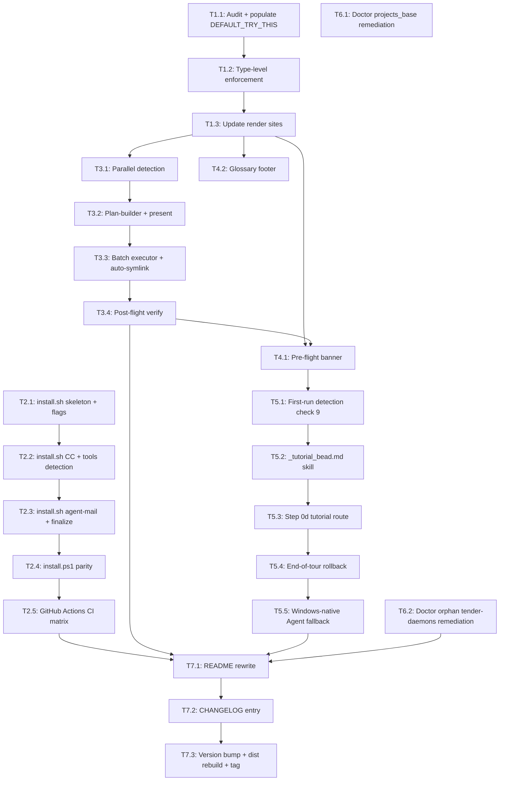

# agent-flywheel Noob-Onboarding Implementation Plan (v3.16.0)

> **For agentic workers:** REQUIRED SUB-SKILL: Use superpowers:subagent-driven-development (recommended) or superpowers:executing-plans to implement this plan task-by-task. Steps use checkbox (`- [ ]`) syntax for tracking.

**Goal:** Make agent-flywheel turnkey for mid-level devs new to agentic coding: curl|bash + PowerShell bootstrap, one-batch /flywheel-setup, first-run tutorial-bead, inline glossary, try_this on every error, pre-flight banner, doctor inline-remediation expansion. macOS+Linux+Windows. Single v3.16.0 mega-release.

**Architecture:** Build on existing skills (no new architectural surface). Add 5 new files (install.sh, install.ps1, _tutorial_bead.md, errors-try-this.ts, platform.ts) and modify 9 existing (flywheel-setup, flywheel-doctor, start SKILL.md + _inflight_prompt.md, README, errors.ts, doctor.ts, profile.ts). All changes additive — no breaking changes for existing users.

**Tech Stack:** TypeScript (MCP server), Bash 5 (install.sh), PowerShell 7 (install.ps1), Markdown (skills), GitHub Actions (CI matrix: macos/ubuntu/docker/windows).

**Spec:** [docs/superpowers/specs/2026-05-12-noob-onboarding-design.md](../superpowers/specs/2026-05-12-noob-onboarding-design.md)

---

## Summary

**24 atomic tasks** across **7 PR groupings**, total **~1290 LOC**. Tier 1 (errors.ts, installer, doctor remediation) parallelizable; Tier 2 (setup batch) blocks on errors.ts; Tier 3 (banner + glossary + tutorial + Windows fallback) blocks on setup batch; Tier 4 (release artifacts) blocks on everything.

## Dependency graph



**Parallelism opportunity:** T1.*, T2.*, T6.* can run on three independent worktrees concurrently. T3.* depends on T1.3 only. T4.* and T5.* are sequential (UI surface). T7.* is the release sequence.

## Phases

- **Phase 1 (parallel):** T1.1, T1.2, T1.3, T2.1, T2.2, T2.3, T2.4, T2.5, T6.1, T6.2 → 10 tasks
- **Phase 2 (serial-ish):** T3.1, T3.2, T3.3, T3.4 → 4 tasks (setup batch)
- **Phase 3 (serial):** T4.1, T4.2, T5.1, T5.2, T5.3, T5.4, T5.5 → 7 tasks (UX layer + Windows fallback)
- **Phase 4 (release):** T7.1, T7.2, T7.3 → 3 tasks

---

## Phase 1 tasks

### Task T1.1: Audit FlywheelErrorCode + populate DEFAULT_TRY_THIS

**Files:**
- Modify: `mcp-server/src/errors.ts`
- Modify: `mcp-server/src/errors-try-this.ts` (extend existing dict from v3.15.0)
- Test: `mcp-server/test/errors-try-this.test.ts`

**depends_on:** []  **est LOC:** 70  **PR:** #1

- [ ] **Step 1: Inventory the error codes**

Run:
```bash
grep -E "^\s+['\"][a-z_]+['\"]" mcp-server/src/errors.ts | sed -E "s/.*['\"](.*)['\"].*/\1/" | sort -u > /tmp/codes.txt
wc -l /tmp/codes.txt  # should match FLYWHEEL_ERROR_CODES length
```

- [ ] **Step 2: Write the failing test that enforces coverage**

```ts
// mcp-server/test/errors-try-this.test.ts
import { FLYWHEEL_ERROR_CODES } from '../src/errors.js';
import { DEFAULT_HINTS, DEFAULT_TRY_THIS } from '../src/errors-try-this.js';

describe('error meta coverage', () => {
  it.each(FLYWHEEL_ERROR_CODES)('code %s has both hint and tryThis', (code) => {
    expect(DEFAULT_HINTS[code]).toBeDefined();
    expect(DEFAULT_HINTS[code]).not.toBe('');
    expect(DEFAULT_TRY_THIS[code]).toBeDefined();
    expect(DEFAULT_TRY_THIS[code]).not.toBe('');
  });
});
```

- [ ] **Step 3: Run failing test**

Run: `cd mcp-server && npm test -- errors-try-this`
Expected: FAIL — some codes missing tryThis entries

- [ ] **Step 4: Populate missing entries**

For each code in `/tmp/codes.txt` not in `DEFAULT_TRY_THIS`, add a paste-ready command. Examples:
```ts
export const DEFAULT_TRY_THIS: Record<FlywheelErrorCode, string> = {
  missing_prerequisite: '/agent-flywheel:flywheel-setup',
  agent_mail_unreachable: 'am serve-http --port 8765 &',
  blocked_state: '/agent-flywheel:flywheel-status',
  template_placeholder_missing: 'See `details.missing` and re-call with all fields',
  // ... one entry per code
};
```

- [ ] **Step 5: Run test to verify pass**

Run: `cd mcp-server && npm test -- errors-try-this`
Expected: PASS (47 codes × 2 fields covered)

- [ ] **Step 6: Commit**

```bash
git add mcp-server/src/errors-try-this.ts mcp-server/test/errors-try-this.test.ts
git commit -m "feat(errors): populate DEFAULT_TRY_THIS for every FlywheelErrorCode"
```

**Acceptance criteria:**
- Every code in `FLYWHEEL_ERROR_CODES` has a non-empty entry in BOTH `DEFAULT_HINTS` and `DEFAULT_TRY_THIS`.
- Test `errors-try-this.test.ts` passes.
- No regression in existing error-rendering snapshot tests.

**Verification:** `npm test` in mcp-server passes; spot-check 5 random codes by triggering them and verifying both fields render.

---

### Task T1.2: Type-level enforcement for error meta

**Files:**
- Modify: `mcp-server/src/errors.ts:1-50`
- Modify: `mcp-server/src/errors-try-this.ts:1-30`
- Test: `mcp-server/test/errors-types.test-d.ts`

**depends_on:** [T1.1]  **est LOC:** 40  **PR:** #1

- [ ] **Step 1: Define the ErrorMeta type**

In `mcp-server/src/errors.ts`:
```ts
export type ErrorMeta = {
  readonly hint: string;
  readonly tryThis: string;
};
```

- [ ] **Step 2: Replace separate dicts with a single ERROR_META record**

In `errors-try-this.ts`, replace `DEFAULT_HINTS` and `DEFAULT_TRY_THIS` with:
```ts
export const ERROR_META: Record<FlywheelErrorCode, ErrorMeta> = {
  missing_prerequisite: { hint: 'run /flywheel-setup to install dependencies', tryThis: '/agent-flywheel:flywheel-setup' },
  // ... all 47 codes
};
export const DEFAULT_HINTS = Object.fromEntries(Object.entries(ERROR_META).map(([k, v]) => [k, v.hint])) as Record<FlywheelErrorCode, string>;
export const DEFAULT_TRY_THIS = Object.fromEntries(Object.entries(ERROR_META).map(([k, v]) => [k, v.tryThis])) as Record<FlywheelErrorCode, string>;
```

- [ ] **Step 3: Write a `.test-d.ts` type test**

```ts
// mcp-server/test/errors-types.test-d.ts
import { expectType } from 'tsd';
import { ERROR_META, ErrorMeta } from '../src/errors-try-this.js';
import { FLYWHEEL_ERROR_CODES, FlywheelErrorCode } from '../src/errors.js';

// Force TypeScript to verify exhaustiveness — missing key would be a compile error
const _coverageCheck: Record<FlywheelErrorCode, ErrorMeta> = ERROR_META;
expectType<Record<FlywheelErrorCode, ErrorMeta>>(_coverageCheck);
```

- [ ] **Step 4: Add a build-time guard script**

In `mcp-server/scripts/verify-error-meta.js`:
```js
const { ERROR_META } = require('../dist/errors-try-this.js');
const { FLYWHEEL_ERROR_CODES } = require('../dist/errors.js');
const missing = FLYWHEEL_ERROR_CODES.filter(c => !ERROR_META[c]?.hint || !ERROR_META[c]?.tryThis);
if (missing.length) { console.error('Missing error meta:', missing); process.exit(1); }
console.log('All', FLYWHEEL_ERROR_CODES.length, 'error codes have hint + tryThis');
```

Wire it into `package.json` `prepublishOnly` or CI:
```json
"scripts": { "verify:error-meta": "node scripts/verify-error-meta.js" }
```

- [ ] **Step 5: Run build + test**

Run:
```bash
cd mcp-server && npm run build && npm run verify:error-meta && npm test
```
Expected: PASS

- [ ] **Step 6: Commit**

```bash
git add mcp-server/src/errors.ts mcp-server/src/errors-try-this.ts mcp-server/scripts/verify-error-meta.js mcp-server/test/errors-types.test-d.ts mcp-server/package.json
git commit -m "feat(errors): type-level enforcement that every code has hint + tryThis"
```

**Acceptance criteria:**
- `ERROR_META` is exhaustively typed against `FlywheelErrorCode`.
- CI script `verify:error-meta` fails build if any code missing either field.
- Existing consumers of `DEFAULT_HINTS` / `DEFAULT_TRY_THIS` still work (backwards-compat shims preserved).

**Verification:** Add a new fake error code, omit its `tryThis`, verify build fails. Remove the fake code, verify build passes.

---

### Task T1.3: Update render sites to surface tryThis everywhere

**Files:**
- Modify: `mcp-server/src/tools/*.ts` (every tool that emits structured errors)
- Modify: `mcp-server/src/format-error.ts` (or create if not exists)
- Test: `mcp-server/test/format-error.test.ts`

**depends_on:** [T1.2]  **est LOC:** 40  **PR:** #1

- [ ] **Step 1: Centralize error rendering**

Create `mcp-server/src/format-error.ts`:
```ts
import { ERROR_META } from './errors-try-this.js';
import type { FlywheelError } from './errors.js';

export function renderError(err: FlywheelError): string {
  const meta = ERROR_META[err.code];
  return [
    `❌ ${err.code}: ${err.message}`,
    `   Hint: ${err.hint ?? meta.hint}`,
    `   Try:  ${err.tryThis ?? meta.tryThis}`,
  ].join('\n');
}
```

- [ ] **Step 2: Write a snapshot test**

```ts
// mcp-server/test/format-error.test.ts
import { renderError } from '../src/format-error.js';

test('renders structured error with hint + try', () => {
  const err = { code: 'missing_prerequisite' as const, message: 'br not installed' };
  expect(renderError(err)).toMatchInlineSnapshot(`
"❌ missing_prerequisite: br not installed
   Hint: run /flywheel-setup to install dependencies
   Try:  /agent-flywheel:flywheel-setup"
`);
});
```

- [ ] **Step 3: Audit grep for inline error rendering**

```bash
grep -rn "error.hint\b" mcp-server/src/ | grep -v "// "
grep -rn "console.error.*code" mcp-server/src/
```

Replace each found site with `renderError(err)`.

- [ ] **Step 4: Run tests**

Run: `cd mcp-server && npm test`
Expected: PASS (no regressions in any tool's error output snapshot)

- [ ] **Step 5: Commit**

```bash
git add mcp-server/src/format-error.ts mcp-server/src/tools/ mcp-server/test/format-error.test.ts
git commit -m "feat(errors): renderError centralizes hint + tryThis output"
```

**Acceptance criteria:**
- Every place that surfaces a structured error uses `renderError()`.
- Snapshot test locks in the 3-line format (`❌ <code> ... / Hint: / Try:`).
- No tool emits raw error.code without hint+tryThis context.

**Verification:** Trigger 3 different error codes via tool calls; verify each renders the 3-line format consistently.

---

### Task T2.1: install.sh skeleton + flags

**Files:**
- Create: `install.sh` (repo root)
- Create: `install/lib/detect.sh`
- Create: `install/lib/log.sh`
- Test: `install/test/test-detect.bats` (bats-core for bash testing)

**depends_on:** []  **est LOC:** 80  **PR:** #2

- [ ] **Step 1: Create the skeleton with flags**

`install.sh`:
```bash
#!/usr/bin/env bash
# install.sh — bootstrap agent-flywheel on a fresh machine
# Usage: curl -sSL https://example.com/install.sh | bash [-- --noninteractive]
set -euo pipefail

NONINTERACTIVE=0
SKIP_LAUNCH=0
SKIP_MCP_REGISTER=0
SKIP_AGENT_MAIL=0

for arg in "$@"; do
  case "$arg" in
    --noninteractive) NONINTERACTIVE=1 ;;
    --skip-launch) SKIP_LAUNCH=1 ;;
    --skip-mcp-register) SKIP_MCP_REGISTER=1 ;;
    --skip-agent-mail) SKIP_AGENT_MAIL=1 ;;
    *) echo "Unknown flag: $arg" >&2; exit 1 ;;
  esac
done

SCRIPT_DIR="$(cd "$(dirname "${BASH_SOURCE[0]}")" && pwd)"
source "$SCRIPT_DIR/install/lib/log.sh"
source "$SCRIPT_DIR/install/lib/detect.sh"

LOG_DIR="$HOME/.agent-flywheel"
mkdir -p "$LOG_DIR"
LOG_FILE="$LOG_DIR/install.log"
log "install.sh started: $(date -u +%FT%TZ)"
```

- [ ] **Step 2: Create lib/log.sh**

```bash
#!/usr/bin/env bash
log() { echo "[$(date -u +%H:%M:%S)] $*" | tee -a "${LOG_FILE:-/dev/null}" >&2; }
err() { echo "❌ $*" | tee -a "${LOG_FILE:-/dev/null}" >&2; }
ok()  { echo "✓ $*" | tee -a "${LOG_FILE:-/dev/null}"; }
prompt() {
  if [ "${NONINTERACTIVE:-0}" = "1" ]; then return 0; fi
  read -r -p "$1 [Y/n] " reply
  [[ -z "$reply" || "$reply" =~ ^[Yy] ]]
}
```

- [ ] **Step 3: Create lib/detect.sh**

```bash
#!/usr/bin/env bash
detect_os() { uname -s; }            # Darwin / Linux
detect_arch() { uname -m; }
detect_pkg() {
  if command -v brew >/dev/null; then echo "brew"
  elif command -v apt-get >/dev/null; then echo "apt"
  elif command -v dnf >/dev/null; then echo "dnf"
  elif command -v pacman >/dev/null; then echo "pacman"
  else echo "unknown"; fi
}
```

- [ ] **Step 4: Write bats test**

```bash
# install/test/test-detect.bats
#!/usr/bin/env bats
load ../lib/detect.sh

@test "detect_os returns Darwin or Linux" {
  result=$(detect_os)
  [[ "$result" == "Darwin" || "$result" == "Linux" ]]
}
```

- [ ] **Step 5: Run the test**

Run: `bats install/test/test-detect.bats`
Expected: PASS

- [ ] **Step 6: Commit**

```bash
git add install.sh install/lib/ install/test/
git commit -m "feat(install): bash bootstrap skeleton + flags + log/detect libs"
```

**Acceptance criteria:**
- `bash install.sh --noninteractive --help` exits 0 (or shows usage).
- Log file written to `~/.agent-flywheel/install.log`.
- Unknown flag → exit 1.

**Verification:** `bash install.sh --noninteractive --skip-launch` runs without error on macOS + Ubuntu in CI.

---

### Task T2.2: install.sh CC + tools detection + install

**Files:**
- Modify: `install.sh:50-100`
- Create: `install/lib/install-tool.sh`

**depends_on:** [T2.1]  **est LOC:** 80  **PR:** #2

- [ ] **Step 1: Implement install-tool.sh**

```bash
#!/usr/bin/env bash
install_tool() {
  local tool="$1"
  local pkg="${PKG:-brew}"
  log "Installing $tool via $pkg"
  case "$pkg" in
    brew) brew install "burningportra/tap/$tool" || brew install "$tool" ;;
    apt) sudo apt-get install -y "$tool" ;;
    dnf) sudo dnf install -y "$tool" ;;
    pacman) sudo pacman -S --noconfirm "$tool" ;;
    *) err "Cannot auto-install $tool — package manager not recognized"; return 1 ;;
  esac
}
install_claude_code() {
  local pkg="${PKG:-brew}"
  case "$pkg" in
    brew) brew install anthropic/cc/claude ;;
    *) npm install -g @anthropic-ai/claude-cli ;;
  esac
}
```

- [ ] **Step 2: Wire detection + install loop into install.sh**

```bash
PKG=$(detect_pkg)
log "Detected: OS=$(detect_os), arch=$(detect_arch), pkg=$PKG"

if ! command -v claude >/dev/null 2>&1; then
  if prompt "Claude Code not found. Install via $PKG?"; then
    install_claude_code
  fi
fi

MISSING=()
for tool in br bv cm dcg ntm; do
  command -v "$tool" >/dev/null 2>&1 || MISSING+=("$tool")
done

if [ ${#MISSING[@]} -gt 0 ]; then
  log "Missing tools: ${MISSING[*]}"
  if prompt "Install ${#MISSING[@]} tools (${MISSING[*]}) via $PKG?"; then
    for tool in "${MISSING[@]}"; do install_tool "$tool" || err "Failed: $tool"; done
  fi
fi

# Re-source shell config so brew installs are on PATH
[ -f "$HOME/.zshrc" ] && source "$HOME/.zshrc" 2>/dev/null || true
[ -f "$HOME/.bashrc" ] && source "$HOME/.bashrc" 2>/dev/null || true
```

- [ ] **Step 3: Write bats test for install-tool**

```bash
# install/test/test-install-tool.bats
@test "install_tool fails clearly when pkg unknown" {
  PKG=unknown
  source ../lib/install-tool.sh
  run install_tool fakebin
  [ "$status" -eq 1 ]
  [[ "$output" =~ "package manager not recognized" ]]
}
```

- [ ] **Step 4: Run test**

Run: `bats install/test/test-install-tool.bats`
Expected: PASS

- [ ] **Step 5: Commit**

```bash
git add install.sh install/lib/install-tool.sh install/test/test-install-tool.bats
git commit -m "feat(install): CC + required-CLI detection and install loop"
```

**Acceptance criteria:**
- All required CLIs (br/bv/cm/dcg/ntm) installable via the detected package manager.
- CC install fallback to npm when brew not available.
- Failed install of one tool does not abort the loop (logged + continued).

**Verification:** Run on a fresh Ubuntu Docker container without any of the tools; verify all install successfully.

---

### Task T2.3: install.sh agent-mail + Node check + finalize

**Files:**
- Modify: `install.sh:100-150`
- Create: `install/lib/agent-mail.sh`

**depends_on:** [T2.2]  **est LOC:** 60  **PR:** #2

- [ ] **Step 1: Implement agent-mail.sh**

```bash
#!/usr/bin/env bash
start_agent_mail() {
  if curl -fsS --max-time 1 http://127.0.0.1:8765/health/liveness >/dev/null 2>&1; then
    ok "agent-mail already running on :8765"
    return 0
  fi
  if ! command -v am >/dev/null; then
    err "am binary not found; install via brew install burningportra/tap/agent-mail"
    return 1
  fi
  nohup am serve-http --port 8765 >"$LOG_DIR/agent-mail.log" 2>&1 &
  sleep 2
  if curl -fsS --max-time 1 http://127.0.0.1:8765/health/liveness >/dev/null 2>&1; then
    ok "agent-mail HTTP service started"
  else
    err "agent-mail did not respond on :8765 after 2s; check $LOG_DIR/agent-mail.log"
    return 1
  fi
}
```

- [ ] **Step 2: Node check**

```bash
node_ok() {
  if ! command -v node >/dev/null; then err "node not found"; return 1; fi
  local major=$(node -v | sed -E 's/v([0-9]+).*/\1/')
  if [ "$major" -lt 20 ]; then
    err "Node $major < 20; install via nvm install 20"
    return 1
  fi
  ok "Node $(node -v) ✓"
}
```

- [ ] **Step 3: Wire into install.sh**

```bash
node_ok || err "Node 20+ required — install with: nvm install 20"

if [ "$SKIP_AGENT_MAIL" -eq 0 ]; then
  if prompt "Start agent-mail HTTP service on :8765?"; then
    source "$SCRIPT_DIR/install/lib/agent-mail.sh"
    start_agent_mail
  fi
fi

cat <<'EOF'

✓ Bootstrap complete. Now inside Claude Code, run:

  /plugin marketplace add burningportra/agent-flywheel-plugin
  /plugin install agent-flywheel@agent-flywheel
  /agent-flywheel:flywheel-setup

EOF

if [ "$SKIP_LAUNCH" -eq 0 ] && command -v claude >/dev/null 2>&1; then
  if prompt "Launch Claude Code now?"; then claude; fi
fi

ok "install.sh complete"
```

- [ ] **Step 4: Bats test**

```bash
@test "node_ok rejects node 18" {
  function node() { echo "v18.0.0"; }
  export -f node
  run node_ok
  [ "$status" -eq 1 ]
}
```

- [ ] **Step 5: Run test**

Run: `bats install/test/`
Expected: PASS

- [ ] **Step 6: Commit**

```bash
git add install.sh install/lib/agent-mail.sh install/test/
git commit -m "feat(install): agent-mail start, node check, CC launch handoff"
```

**Acceptance criteria:**
- agent-mail starts in background; health endpoint returns 200 within 2s.
- Node < 20 errors with clear nvm fix.
- End-of-script prints 3 CC commands and optionally launches CC.

**Verification:** Full E2E on fresh Docker container; assert agent-mail responds and CC commands print.

---

### Task T2.4: install.ps1 parity

**Files:**
- Create: `install.ps1` (repo root)
- Create: `install/lib/install.ps1` (PowerShell helpers)
- Test: `install/test/test-install-ps1.Tests.ps1` (Pester)

**depends_on:** [T2.3]  **est LOC:** 100  **PR:** #2

- [ ] **Step 1: Write install.ps1 skeleton**

```powershell
#Requires -Version 7
param(
  [switch]$Noninteractive,
  [switch]$SkipLaunch,
  [switch]$SkipMcpRegister,
  [switch]$SkipAgentMail
)
$ErrorActionPreference = 'Stop'
$LogDir = "$HOME\.agent-flywheel"
New-Item -ItemType Directory -Path $LogDir -Force | Out-Null
$LogFile = "$LogDir\install.log"
function Log($msg) { "$(Get-Date -Format 'HH:mm:ss') $msg" | Tee-Object -FilePath $LogFile -Append | Write-Host }

# WSL2 recommendation
if (Get-Command wsl -ErrorAction SilentlyContinue) {
  Log "ℹ WSL2 detected. For full multi-agent swarm features, consider:"
  Log "    wsl -e bash -c 'curl -sSL <url>/install.sh | bash'"
  Log "  Continuing with native Windows install (NTM will be unavailable)."
}
```

- [ ] **Step 2: Tool detection + install via winget/scoop**

```powershell
function Install-Tool($tool) {
  $pkg = if (Get-Command winget -ErrorAction SilentlyContinue) { 'winget' }
         elseif (Get-Command scoop -ErrorAction SilentlyContinue) { 'scoop' }
         else { throw "Neither winget nor scoop found" }
  switch ($pkg) {
    'winget' { winget install --id "burningportra.$tool" --silent }
    'scoop'  { scoop install $tool }
  }
}

$missing = @()
foreach ($t in 'br','bv','cm','dcg') {  # NTM omitted — tmux-only
  if (-not (Get-Command $t -ErrorAction SilentlyContinue)) { $missing += $t }
}
if ($missing.Count -gt 0) {
  Log "Missing: $($missing -join ', ')"
  if ($Noninteractive -or (Read-Host "Install all? [Y/n]") -match '^Y?$') {
    foreach ($t in $missing) { Install-Tool $t }
  }
}
Log "ℹ NTM is tmux-based; not available on native Windows. Use WSL2 for parallel swarm."
```

- [ ] **Step 3: agent-mail start**

```powershell
if (-not $SkipAgentMail) {
  $alive = try { (Invoke-WebRequest -Uri 'http://127.0.0.1:8765/health/liveness' -TimeoutSec 1).StatusCode -eq 200 } catch { $false }
  if (-not $alive) {
    if ($Noninteractive -or (Read-Host "Start agent-mail HTTP on :8765? [Y/n]") -match '^Y?$') {
      Start-Process -WindowStyle Hidden -FilePath 'am' -ArgumentList 'serve-http','--port','8765' -RedirectStandardOutput "$LogDir\agent-mail.log"
      Start-Sleep -Seconds 2
    }
  }
}
```

- [ ] **Step 4: Finalize + handoff**

```powershell
Write-Host @"

✓ Bootstrap complete. Now inside Claude Code, run:

  /plugin marketplace add burningportra/agent-flywheel-plugin
  /plugin install agent-flywheel@agent-flywheel
  /agent-flywheel:flywheel-setup

"@

if (-not $SkipLaunch -and (Get-Command claude -ErrorAction SilentlyContinue)) {
  if ($Noninteractive -or (Read-Host "Launch Claude Code now? [Y/n]") -match '^Y?$') {
    Start-Process claude
  }
}
```

- [ ] **Step 5: Parity snapshot test**

```powershell
# install/test/test-parity.Tests.ps1
Describe 'install.ps1 parity with install.sh' {
  It 'has all 7 numbered logical steps matching install.sh' {
    $ps1 = Get-Content "$PSScriptRoot/../../install.ps1" -Raw
    $sh  = Get-Content "$PSScriptRoot/../../install.sh"  -Raw
    # Each numbered step header should appear in both
    @('OS detect','Claude Code','Required CLIs','Node check','agent-mail','CC commands','Launch') |
      ForEach-Object { $ps1 | Should -Match $_; $sh | Should -Match $_ }
  }
}
```

- [ ] **Step 6: Run Pester**

Run: `pwsh -Command "Invoke-Pester install/test/"`
Expected: PASS

- [ ] **Step 7: Commit**

```bash
git add install.ps1 install/lib/install.ps1 install/test/
git commit -m "feat(install): install.ps1 with PowerShell parity to install.sh"
```

**Acceptance criteria:**
- install.ps1 implements all 7 numbered logical steps from install.sh.
- NTM flagged as unavailable on native Windows; WSL2 recommended.
- Pester parity test asserts both scripts cover the same step headers.

**Verification:** Run install.ps1 on a fresh Windows 11 VM; assert all 4 required tools installed and agent-mail health endpoint returns 200.

---

### Task T2.5: GitHub Actions CI matrix

**Files:**
- Create: `.github/workflows/install.yml`
- Modify: `.github/workflows/test.yml` (add install-script test job)

**depends_on:** [T2.4]  **est LOC:** 80  **PR:** #2

- [ ] **Step 1: Write CI workflow**

```yaml
# .github/workflows/install.yml
name: install-script
on: [push, pull_request]
jobs:
  unix:
    strategy:
      matrix:
        os: [macos-latest, ubuntu-22.04]
    runs-on: ${{ matrix.os }}
    steps:
      - uses: actions/checkout@v4
      - name: Install bats
        run: |
          if [ "${{ matrix.os }}" = "macos-latest" ]; then brew install bats-core; else sudo npm install -g bats; fi
      - name: Bats unit tests
        run: bats install/test/*.bats
      - name: install.sh smoke
        run: bash install.sh --noninteractive --skip-launch --skip-mcp-register --skip-agent-mail
      - name: Verify CLIs installed
        run: for t in br bv cm dcg ntm; do command -v "$t" || echo "missing $t"; done

  docker:
    runs-on: ubuntu-22.04
    steps:
      - uses: actions/checkout@v4
      - name: Run install.sh in fresh debian:12
        run: |
          docker run --rm -v "$PWD:/work" -w /work debian:12 bash -c \
            "apt-get update && apt-get install -y curl bash && bash install.sh --noninteractive --skip-launch --skip-mcp-register"

  windows:
    runs-on: windows-latest
    steps:
      - uses: actions/checkout@v4
      - name: Install Pester
        shell: pwsh
        run: Install-Module -Name Pester -Force -SkipPublisherCheck
      - name: Pester tests
        shell: pwsh
        run: Invoke-Pester install/test/ -CI
      - name: install.ps1 smoke
        shell: pwsh
        run: .\install.ps1 -Noninteractive -SkipLaunch -SkipMcpRegister -SkipAgentMail
```

- [ ] **Step 2: Add idempotency test**

In the same workflow, add a second invocation that asserts no-op:
```yaml
- name: install.sh idempotency
  run: |
    bash install.sh --noninteractive --skip-launch --skip-mcp-register --skip-agent-mail | tee run2.log
    grep -E "(already installed|no-op|skipped)" run2.log
```

- [ ] **Step 3: Push branch + verify CI**

```bash
git add .github/workflows/install.yml
git commit -m "ci(install): matrix for macos/ubuntu/docker/windows + bats + Pester"
git push origin <branch>
# Watch CI run for each platform
```

- [ ] **Step 4: Iterate until green**

If any platform fails, fix the script + bump the CI back through.

**Acceptance criteria:**
- CI matrix green on macos-latest, ubuntu-22.04, debian:12 Docker, windows-latest.
- Idempotency check passes (second invocation is a no-op).
- All bats + Pester tests pass.

**Verification:** Open PR; assert CI badge green on each platform.

---

### Task T6.1: Doctor projects_base remediation

**Files:**
- Modify: `mcp-server/src/tools/doctor.ts` (add remediation case)
- Modify: `skills/flywheel-doctor/SKILL.md` (document new remediation)
- Test: `mcp-server/test/doctor-remediation.test.ts`

**depends_on:** [T1.3]  **est LOC:** 40  **PR:** #6

- [ ] **Step 1: Write failing test**

```ts
test('projects_base remediation creates symlink (dry-run)', async () => {
  const result = await remediateProjectsBase({
    cwd: '/test/proj',
    ntmBase: '/test/ntm-base',
    mode: 'dry-run',
  });
  expect(result.command).toBe('ln -s "/test/proj" "/test/ntm-base/proj"');
  expect(result.executed).toBe(false);
});
```

- [ ] **Step 2: Run failing test**

Run: `npm test -- doctor-remediation`
Expected: FAIL — `remediateProjectsBase` not defined

- [ ] **Step 3: Implement the remediation**

In `doctor.ts`:
```ts
export async function remediateProjectsBase(opts: { cwd: string; ntmBase: string; mode: 'dry-run' | 'execute' | 'skip' }) {
  const basename = path.basename(opts.cwd);
  const target = path.join(opts.ntmBase, basename);
  const command = `ln -s "${opts.cwd}" "${target}"`;
  if (opts.mode === 'dry-run' || opts.mode === 'skip') {
    return { command, executed: false };
  }
  await fs.symlink(opts.cwd, target);
  return { command, executed: true };
}
```

- [ ] **Step 4: Wire into doctor's inline-remediation switch**

In `doctor.ts` where `orphaned_worktrees` and other checks have remediation:
```ts
case 'projects_base_misconfig':
  return remediateProjectsBase({ cwd, ntmBase, mode });
```

- [ ] **Step 5: Update SKILL.md**

Add row to `flywheel-doctor/SKILL.md` remediation table for `projects_base_misconfig`.

- [ ] **Step 6: Run test**

Run: `npm test -- doctor-remediation`
Expected: PASS

- [ ] **Step 7: Commit**

```bash
git add mcp-server/src/tools/doctor.ts skills/flywheel-doctor/SKILL.md mcp-server/test/doctor-remediation.test.ts
git commit -m "feat(doctor): inline remediation for projects_base misconfig"
```

**Acceptance criteria:**
- Doctor's dry-run/execute/skip menu offers projects_base symlink fix.
- Test covers both modes; doesn't actually symlink in test (uses tmp dir).
- Re-verification check fires after execute (the original Step 0b check 7).

**Verification:** Set up a misconfigured project, run /flywheel-doctor, pick "execute" — symlink appears in NTM_BASE; doctor re-check returns green.

---

### Task T6.2: Doctor orphan tender-daemons remediation

**Files:**
- Modify: `mcp-server/src/tools/doctor.ts`
- Modify: `skills/flywheel-doctor/SKILL.md`
- Test: `mcp-server/test/doctor-remediation.test.ts`
- Create: `mcp-server/src/platform.ts` (cross-platform `kill`/PowerShell `Stop-Process` wrappers used by both T6.1 and T6.2)

**depends_on:** [T1.3]  **est LOC:** 40  **PR:** #6

- [ ] **Step 1: Failing test**

```ts
test('orphan tender-daemon remediation kills then verifies', async () => {
  const result = await remediateOrphanDaemons({
    pids: [9491],
    mode: 'dry-run',
  });
  expect(result.commands).toEqual(['kill -TERM 9491']);
  expect(result.executed).toBe(false);
});
```

- [ ] **Step 2: Implement**

```ts
export async function remediateOrphanDaemons(opts: { pids: number[]; mode: 'dry-run' | 'execute' | 'skip' }) {
  const commands = opts.pids.map(p => `kill -TERM ${p}`);
  if (opts.mode !== 'execute') return { commands, executed: false };
  const results = [];
  for (const pid of opts.pids) {
    try {
      process.kill(pid, 'SIGTERM');
      await new Promise(r => setTimeout(r, 1000));
      try { process.kill(pid, 0); process.kill(pid, 'SIGKILL'); results.push({ pid, status: 'killed' }); }
      catch { results.push({ pid, status: 'terminated' }); }
    } catch (e) { results.push({ pid, status: 'error', error: e.message }); }
  }
  return { commands, executed: true, results };
}
```

- [ ] **Step 3: Run test**

Run: `npm test -- doctor-remediation`
Expected: PASS

- [ ] **Step 4: Commit**

```bash
git add mcp-server/src/tools/doctor.ts skills/flywheel-doctor/SKILL.md
git commit -m "feat(doctor): inline remediation for orphan tender-daemons"
```

**Acceptance criteria:**
- Doctor offers dry-run/execute/skip for each detected orphan PID.
- Execute sends SIGTERM, waits 1s, sends SIGKILL if still alive, then verifies.
- Re-verification check fires after execute.

**Verification:** Spawn a fake long-running process matching tender-daemon detection pattern, run doctor, pick execute — process gone, doctor re-check green.

---

## Phase 2 tasks (setup batch)

### Task T3.1: Parallel detection in /flywheel-setup

**Files:**
- Modify: `skills/flywheel-setup/SKILL.md` (replace per-tool loop with parallel detection block)
- Create: `mcp-server/src/setup-detector.ts` (TypeScript helper, optional)

**depends_on:** [T1.3]  **est LOC:** 70  **PR:** #3

- [ ] **Step 1: Failing test for detector**

```ts
test('detect returns plan with missing tools and configs', async () => {
  const result = await detectInstallState({ cwd: '/test/proj' });
  expect(result).toMatchObject({
    install: expect.any(Array),
    register: expect.any(Array),
    start: expect.any(Array),
    configure: expect.any(Array),
    skip: expect.any(Array),
  });
});
```

- [ ] **Step 2: Implement detector**

```ts
// mcp-server/src/setup-detector.ts
import { execSync } from 'child_process';
import * as path from 'path';

export type InstallPlan = {
  install: string[]; register: string[]; start: string[];
  configure: string[]; skip: string[];
};

export async function detectInstallState(opts: { cwd: string }): Promise<InstallPlan> {
  const plan: InstallPlan = { install: [], register: [], start: [], configure: [], skip: [] };

  const checks = await Promise.all([
    has('br'), has('bv'), has('cm'), has('dcg'), has('ntm'),
    isAgentMailAlive(), isMcpRegistered(), getNtmBase(),
  ]);

  for (const [tool, ok] of [['br', checks[0]], ['bv', checks[1]], ['cm', checks[2]], ['dcg', checks[3]], ['ntm', checks[4]]] as const) {
    (ok ? plan.skip : plan.install).push(tool);
  }
  if (!checks[5]) plan.start.push('agent-mail HTTP');
  if (!checks[6]) plan.register.push('MCP server');
  const ntmBase = checks[7];
  if (ntmBase && !path.existsSync(path.join(ntmBase, path.basename(opts.cwd)))) {
    plan.configure.push(`projects_base symlink: ${ntmBase}/${path.basename(opts.cwd)}`);
  }
  return plan;
}

function has(bin: string): boolean { try { execSync(`command -v ${bin}`); return true; } catch { return false; } }
async function isAgentMailAlive(): Promise<boolean> { /* fetch :8765 */ return false; }
async function isMcpRegistered(): Promise<boolean> { /* read ~/.claude.json */ return false; }
function getNtmBase(): string | null { /* parse ntm config show */ return null; }
```

- [ ] **Step 3: Wire into flywheel-setup SKILL.md**

Replace the 12-step per-tool loop with:
```markdown
### Step 1: Parallel detection
Call `detectInstallState({ cwd })`. Use the returned `plan` object for Step 2.
```

- [ ] **Step 4: Run tests**

Run: `npm test -- setup-detector`
Expected: PASS

- [ ] **Step 5: Commit**

```bash
git add mcp-server/src/setup-detector.ts skills/flywheel-setup/SKILL.md mcp-server/test/setup-detector.test.ts
git commit -m "feat(setup): parallel detection returning structured InstallPlan"
```

**Acceptance criteria:**
- `detectInstallState` runs all checks in parallel via Promise.all.
- Returns structured plan with 5 buckets.
- SKILL.md references the detector at Step 1.

**Verification:** Mock 5 different install states; assert each produces the expected plan shape.

---

### Task T3.2: Plan-builder + present (one AskUserQuestion)

**Files:**
- Modify: `skills/flywheel-setup/SKILL.md` (Step 2 — render plan + ask)
- Modify: `mcp-server/src/setup-detector.ts` (add `renderPlan`)
- Test: `mcp-server/test/render-plan.test.ts`

**depends_on:** [T3.1]  **est LOC:** 60  **PR:** #3

- [ ] **Step 1: Test for renderPlan**

```ts
test('renderPlan formats bulleted list', () => {
  const plan = { install: ['br', 'bv'], register: ['MCP'], start: [], configure: [], skip: ['cm', 'ntm'] };
  expect(renderPlan(plan)).toMatchInlineSnapshot(`
"Install plan:
  • Install 2 tools: br, bv
  • Register: MCP server
  • Symlink: (none)
  • Start: (none)
  • Skip (already configured): cm, ntm"
`);
});
```

- [ ] **Step 2: Implement renderPlan**

```ts
export function renderPlan(plan: InstallPlan): string {
  const lines = ['Install plan:'];
  lines.push(plan.install.length ? `  • Install ${plan.install.length} tools: ${plan.install.join(', ')}` : '  • Install: (none)');
  lines.push(plan.register.length ? `  • Register: ${plan.register.join(', ')}` : '  • Register: (none)');
  lines.push(plan.configure.length ? `  • Symlink: ${plan.configure.join(', ')}` : '  • Symlink: (none)');
  lines.push(plan.start.length ? `  • Start: ${plan.start.join(', ')}` : '  • Start: (none)');
  if (plan.skip.length) lines.push(`  • Skip (already configured): ${plan.skip.join(', ')}`);
  return lines.join('\n');
}
```

- [ ] **Step 3: SKILL.md Step 2 update**

```markdown
### Step 2: Present plan
Call `renderPlan(plan)` and surface via AskUserQuestion:
- "Run the whole batch (Recommended)"  → execute Step 3 batch
- "Review each step"                    → fall back to legacy per-tool prompts
- "Cancel"                              → exit setup
```

- [ ] **Step 4: Empty-plan short-circuit**

```ts
export function isPlanEmpty(plan: InstallPlan): boolean {
  return plan.install.length + plan.register.length + plan.start.length + plan.configure.length === 0;
}
```

In SKILL.md: if `isPlanEmpty(plan)` then print "Everything already configured. Run /flywheel-doctor to verify." and exit.

- [ ] **Step 5: Run test**

Run: `npm test -- render-plan`
Expected: PASS

- [ ] **Step 6: Commit**

```bash
git add skills/flywheel-setup/SKILL.md mcp-server/src/setup-detector.ts mcp-server/test/render-plan.test.ts
git commit -m "feat(setup): renderPlan + single AskUserQuestion consent gate"
```

**Acceptance criteria:**
- One AskUserQuestion call surfaces the entire plan.
- Empty plan short-circuits to "already configured" message.
- "Review each step" fallback preserves legacy per-tool prompts.

**Verification:** Snapshot test for 5 input combinations.

---

### Task T3.3: Batch executor + auto-symlink

**Files:**
- Modify: `skills/flywheel-setup/SKILL.md` (Step 3 — batch execution)
- Modify: `mcp-server/src/setup-detector.ts` (add `executeBatch`)
- Test: `mcp-server/test/execute-batch.test.ts`

**depends_on:** [T3.2]  **est LOC:** 80  **PR:** #3

- [ ] **Step 1: Failing test**

```ts
test('executeBatch runs install + symlink + agent-mail sequentially', async () => {
  const plan = { install: ['br'], register: ['MCP'], start: ['agent-mail HTTP'], configure: ['projects_base symlink: /base/proj'], skip: [] };
  const stub = createBatchStub();  // captures invocations without side effects
  await executeBatch(plan, stub);
  expect(stub.calls).toEqual([
    { fn: 'installTool', arg: 'br' },
    { fn: 'registerMcp', arg: 'MCP' },
    { fn: 'symlink', arg: '/base/proj' },
    { fn: 'startAgentMail', arg: undefined },
  ]);
});
```

- [ ] **Step 2: Implement executeBatch**

```ts
export async function executeBatch(plan: InstallPlan, exec: BatchExecutor): Promise<BatchResult[]> {
  const results: BatchResult[] = [];
  for (const tool of plan.install) results.push(await exec.installTool(tool));
  for (const item of plan.register) results.push(await exec.registerMcp(item));
  for (const cfg of plan.configure) results.push(await exec.symlink(cfg));
  for (const svc of plan.start) results.push(await exec.startAgentMail());
  return results;
}

export interface BatchExecutor {
  installTool(name: string): Promise<BatchResult>;
  registerMcp(name: string): Promise<BatchResult>;
  symlink(spec: string): Promise<BatchResult>;
  startAgentMail(): Promise<BatchResult>;
}
```

- [ ] **Step 3: Auto-symlink helper**

```ts
async function performSymlink(cwd: string, ntmBase: string): Promise<BatchResult> {
  const target = path.join(ntmBase, path.basename(cwd));
  try {
    await fs.symlink(cwd, target);
    return { status: 'ok', step: 'symlink', target };
  } catch (e) {
    return { status: 'error', step: 'symlink', error: e.message };
  }
}
```

- [ ] **Step 4: MCP register atomic-write helper**

```ts
// in setup-detector.ts
async function registerMcpAtomic(): Promise<BatchResult> {
  const target = path.join(os.homedir(), '.claude.json');
  const tmp = `${target}.tmp.${process.pid}`;
  let cfg: any = {};
  try { cfg = JSON.parse(await fs.readFile(target, 'utf-8')); } catch { /* file missing OK */ }
  cfg.mcpServers ??= {};
  if (cfg.mcpServers['agent-flywheel']) {
    return { status: 'ok', step: 'registerMcp', note: 'already registered' };
  }
  cfg.mcpServers['agent-flywheel'] = {
    command: 'node',
    args: [path.join(process.env.CLAUDE_PLUGIN_ROOT ?? '', 'mcp-server/dist/index.js')],
  };
  await fs.writeFile(tmp, JSON.stringify(cfg, null, 2));
  await fs.rename(tmp, target);  // atomic on POSIX
  return { status: 'ok', step: 'registerMcp' };
}
```

Write a snapshot test that asserts the merged `~/.claude.json` keeps any pre-existing `mcpServers` entries untouched.

- [ ] **Step 5: Failure handling in SKILL.md**

```markdown
### Step 3: Execute batch
For each step in plan, execute and log to ~/.agent-flywheel/setup.log.
On failure of any step:
  - Surface error.tryThis from rendered error
  - AskUserQuestion: Retry | Skip and continue | Abort
```

- [ ] **Step 6: Run test**

Run: `npm test -- execute-batch`
Expected: PASS

- [ ] **Step 7: Commit**

```bash
git add mcp-server/src/setup-detector.ts skills/flywheel-setup/SKILL.md mcp-server/test/execute-batch.test.ts
git commit -m "feat(setup): batch executor with failure handling + auto-symlink + MCP register"
```

**Acceptance criteria:**
- Each plan section executes in defined order.
- Failure of one step surfaces error.tryThis and offers retry/skip/abort.
- Symlink uses atomic check + fs.symlink.
- MCP registration uses atomic tmp+rename; preserves existing `mcpServers` keys.

**Verification:** Run batch with a failing install step (mock broken brew) — assert tryThis surfaces and user gets retry menu.

---

### Task T3.4: Post-flight verify + green message

**Files:**
- Modify: `skills/flywheel-setup/SKILL.md` (Step 4 — post-flight)
- Test: `mcp-server/test/post-flight.test.ts`

**depends_on:** [T3.3]  **est LOC:** 40  **PR:** #3

- [ ] **Step 1: Test**

```ts
test('post-flight calls flywheel_doctor and renders summary', async () => {
  const doctorMock = jest.fn().mockResolvedValue({ overall: 'green', checks: [] });
  const summary = await runPostFlight({ cwd: '/test', doctor: doctorMock });
  expect(doctorMock).toHaveBeenCalled();
  expect(summary).toMatch(/Setup complete/);
});
```

- [ ] **Step 2: Implement runPostFlight**

```ts
export async function runPostFlight(opts: { cwd: string; doctor: typeof flywheel_doctor }): Promise<string> {
  const report = await opts.doctor({ cwd: opts.cwd });
  if (report.overall === 'green') {
    return '✓ Setup complete. Run /agent-flywheel:start to begin.';
  }
  const failing = report.checks.filter(c => c.severity !== 'green');
  return [
    `⚠ Setup left ${failing.length} issue(s):`,
    ...failing.map(c => `  • ${c.name}: ${c.message}\n    Try: ${c.hint ?? 'see /flywheel-doctor'}`),
  ].join('\n');
}
```

- [ ] **Step 3: SKILL.md Step 4**

```markdown
### Step 4: Post-flight
After batch execution:
1. Call flywheel_doctor (read-only)
2. Render summary via runPostFlight
3. If green: success message + pointer to /start
4. If yellow/red: list failing checks + their tryThis, exit nonzero
```

- [ ] **Step 4: Run test**

Run: `npm test -- post-flight`
Expected: PASS

- [ ] **Step 5: Commit**

```bash
git add skills/flywheel-setup/SKILL.md mcp-server/src/setup-detector.ts mcp-server/test/post-flight.test.ts
git commit -m "feat(setup): post-flight doctor verify + green/yellow render"
```

**Acceptance criteria:**
- Doctor invoked exactly once after batch.
- Green report → success message.
- Yellow/red → failing checks listed with tryThis; nonzero exit.

**Verification:** Stub doctor to return each severity; assert correct summary text.

---

## Phase 3 tasks (UX layer)

### Task T4.1: Pre-flight banner on /start

**Files:**
- Modify: `skills/start/SKILL.md` (Step 0c)
- Test: `skills/start/test/preflight-banner.snap.md` (snapshot fixtures)

**depends_on:** [T1.3, T3.4]  **est LOC:** 50  **PR:** #4

- [ ] **Step 1: Write snapshot fixtures**

Create 8 input fixtures × expected output snapshots in `skills/start/test/preflight-banner/`:
- `all-clear.json` → no banner block
- `bv-missing.json` → banner with bv tryThis
- `agent-mail-down.json` → banner with am tryThis
- `projects-base-mismatch.json` → banner with ln -s tryThis
- 4 combination cases

- [ ] **Step 2: Add banner logic to Step 0c**

In `skills/start/SKILL.md` Step 0c, after the welcome banner:
```markdown
### Pre-flight issue surfacing

If DOCTOR_REPORT contains any of: required CLI missing (br/bv/cm), agent_mail_liveness=red, mcp_connectivity=red, projects_base_misconfig=red:

Render this block above the menu:
```
⚠ Pre-flight issues:
   • <check.name> — <check.message>  → Try: <check.tryThis>
   ...

Run /agent-flywheel:flywheel-setup to fix all at once, or continue with degraded features.
```

Then surface:
```
AskUserQuestion(questions: [{
  question: "Pre-flight issues detected. How to proceed?",
  header: "Pre-flight",
  options: [
    { label: "Run setup now (Recommended)", description: "Launches /flywheel-setup" },
    { label: "Continue with degraded", description: "Skip setup, use degraded-mode overrides from 0f" },
    { label: "Show me what's degraded", description: "Print the doctor row by row, then re-prompt" }
  ],
  multiSelect: false
}])
```
```

- [ ] **Step 3: Snapshot test runner**

```ts
// skills/start/test/preflight-banner.test.ts
import fs from 'fs';
import { renderPreflightBanner } from '../../mcp-server/src/preflight.ts';

const fixtures = fs.readdirSync('./fixtures').filter(f => f.endsWith('.json'));
for (const f of fixtures) {
  test(`snapshot ${f}`, () => {
    const input = JSON.parse(fs.readFileSync(`./fixtures/${f}`, 'utf-8'));
    expect(renderPreflightBanner(input)).toMatchSnapshot();
  });
}
```

- [ ] **Step 4: Implement renderPreflightBanner**

```ts
export function renderPreflightBanner(report: DoctorReport): string | null {
  const issues = report.checks.filter(c =>
    ['br_binary','bv_binary','cm_binary','agent_mail_liveness','mcp_connectivity','projects_base'].includes(c.name)
    && c.severity !== 'green'
  );
  if (issues.length === 0) return null;
  return [
    '⚠ Pre-flight issues:',
    ...issues.map(c => `   • ${c.name} — ${c.message}  → Try: ${c.tryThis ?? c.hint ?? 'see /flywheel-doctor'}`),
    '',
    'Run /agent-flywheel:flywheel-setup to fix all at once, or continue with degraded features.',
  ].join('\n');
}
```

- [ ] **Step 5: Run snapshot tests**

Run: `npm test -- preflight-banner`
Expected: PASS (all 8 snapshots match)

- [ ] **Step 6: Commit**

```bash
git add skills/start/SKILL.md mcp-server/src/preflight.ts skills/start/test/
git commit -m "feat(start): pre-flight banner surfaces missing deps with tryThis"
```

**Acceptance criteria:**
- Banner renders only when ≥1 critical check fails.
- AskUserQuestion offers 3 options (run setup / continue degraded / show details).
- All 8 snapshot fixtures pass.

**Verification:** Trigger each issue individually on a real machine; verify banner renders correctly.

---

### Task T4.2: Inline glossary footer

**Files:**
- Modify: `skills/start/SKILL.md` (Step 0d main menu, every variant)
- Modify: `skills/flywheel-doctor/SKILL.md` (output section)
- Modify: `skills/flywheel-setup/SKILL.md` (post-flight section)

**depends_on:** [T1.3]  **est LOC:** 30  **PR:** #4

- [ ] **Step 1: Define the glossary line**

In `mcp-server/src/glossary.ts`:
```ts
export const GLOSSARY_LINE =
  'Glossary: bead=atomic task · plan=grouped beads · flywheel=full loop · NTM=tmux multi-agent · agent-mail=inter-agent inbox · MCP=Model Context Protocol';
```

- [ ] **Step 2: Append to start menu (all 3 variants)**

In `skills/start/SKILL.md` Step 0d, at the very end of each printed block:
```markdown
[printed menu block]

Glossary: bead=atomic task · plan=grouped beads · flywheel=full loop · NTM=tmux multi-agent · agent-mail=inter-agent inbox · MCP=Model Context Protocol
```

- [ ] **Step 3: Append to doctor + setup outputs**

Same one-line addition at the end of doctor's tabular output + setup's post-flight summary.

- [ ] **Step 4: Visual test**

Run `/agent-flywheel:start` locally on the dev machine; verify the glossary line renders below each menu variant + below doctor output + below setup output.

- [ ] **Step 5: Commit**

```bash
git add mcp-server/src/glossary.ts skills/start/SKILL.md skills/flywheel-doctor/SKILL.md skills/flywheel-setup/SKILL.md
git commit -m "feat(ux): inline glossary footer on start menu, doctor, setup"
```

**Acceptance criteria:**
- Single source of truth for the glossary string in `glossary.ts`.
- Glossary appears below every Start menu variant.
- Glossary appears below doctor + setup output.

**Verification:** Manual check — invoke start/doctor/setup and visually confirm.

---

### Task T5.1: First-run detection (Step 0b check 9)

**Files:**
- Modify: `skills/start/SKILL.md` (Step 0b — add check 9)
- Create: `mcp-server/src/first-run.ts`
- Test: `mcp-server/test/first-run.test.ts`

**depends_on:** [T4.1]  **est LOC:** 50  **PR:** #5

- [ ] **Step 1: Failing test (positive case)**

```ts
test('isFirstRun true when all 5 signals absent', async () => {
  const tmpdir = await fs.mkdtemp('/tmp/fw-test-');
  await fs.mkdir(path.join(tmpdir, '.git'));  // valid repo
  const result = await isFirstRun({ cwd: tmpdir, brList: async () => [], cassSearch: async () => [] });
  expect(result).toBe(true);
});
```

- [ ] **Step 2: Failing tests (5 negative cases)**

For each signal, write a test that asserts `isFirstRun` returns false when only that signal is present:
```ts
test.each([
  ['.pi-flywheel/checkpoint.json'],
  ['docs/plans/test.md'],
  ['.pi-orchestrator/state.json'],
])('isFirstRun false when %s exists', async (filepath) => {
  const tmpdir = await fs.mkdtemp('/tmp/fw-test-');
  await fs.mkdir(path.dirname(path.join(tmpdir, filepath)), { recursive: true });
  await fs.writeFile(path.join(tmpdir, filepath), '{}');
  const result = await isFirstRun({ cwd: tmpdir, brList: async () => [], cassSearch: async () => [] });
  expect(result).toBe(false);
});

test('isFirstRun false when beads exist', async () => {
  const tmpdir = await fs.mkdtemp('/tmp/fw-test-');
  const result = await isFirstRun({ cwd: tmpdir, brList: async () => [{ id: 'x' }], cassSearch: async () => [] });
  expect(result).toBe(false);
});

test('isFirstRun false when cass has entries for cwd', async () => {
  const tmpdir = await fs.mkdtemp('/tmp/fw-test-');
  const result = await isFirstRun({ cwd: tmpdir, brList: async () => [], cassSearch: async () => [{ id: 'cass1' }] });
  expect(result).toBe(false);
});
```

- [ ] **Step 3: Implement isFirstRun**

```ts
// mcp-server/src/first-run.ts
import * as fs from 'fs/promises';
import * as path from 'path';

export async function isFirstRun(opts: {
  cwd: string;
  brList: () => Promise<unknown[]>;
  cassSearch: () => Promise<unknown[]>;
}): Promise<boolean> {
  const checks = await Promise.all([
    exists(path.join(opts.cwd, '.pi-flywheel/checkpoint.json')),
    opts.brList().then(d => d.length > 0),
    fs.readdir(path.join(opts.cwd, 'docs/plans')).then(f => f.some(x => x.endsWith('.md'))).catch(() => false),
    exists(path.join(opts.cwd, '.pi-orchestrator')),
    opts.cassSearch().then(d => d.length > 0),
  ]);
  return !checks.some(Boolean);
}

async function exists(p: string): Promise<boolean> {
  try { await fs.stat(p); return true; } catch { return false; }
}
```

- [ ] **Step 4: Wire into Step 0b**

In `skills/start/SKILL.md` Step 0b, add check 9:
```markdown
9. **First-run detection**: Call `isFirstRun({ cwd, brList, cassSearch })`. Cache result as `IS_FIRST_RUN`. The tutorial-bead offer in Step 0d depends on this.
```

- [ ] **Step 5: Run tests**

Run: `npm test -- first-run`
Expected: PASS (1 positive + 5 negative)

- [ ] **Step 6: Commit**

```bash
git add skills/start/SKILL.md mcp-server/src/first-run.ts mcp-server/test/first-run.test.ts
git commit -m "feat(start): first-run detection check 9 in Step 0b"
```

**Acceptance criteria:**
- isFirstRun returns true only when all 5 signals absent.
- Test covers 1 positive + 5 negatives.
- Step 0b check 9 documented in SKILL.md.

**Verification:** Test on actual fresh repo + actual checkpointed repo; assert results.

---

### Task T5.2: Tutorial-bead skill (_tutorial_bead.md)

**Files:**
- Create: `skills/start/_tutorial_bead.md`

**depends_on:** [T5.1]  **est LOC:** 80  **PR:** #5

- [ ] **Step 1: Write the skill file**

Content per spec Section 5:
```markdown
# Tutorial bead — first-run guided tour

> **When to fire.** Only invoked from Step 0d when `IS_FIRST_RUN === true` AND user picked "Take the 5-min tour".

## Step 1 — Welcome + consent

Print:
> "Welcome to agent-flywheel! 5-min tour. I'll run a real micro-bead end-to-end
>  so you can see the loop. Goal: 'Add a CHANGELOG entry for today'.
>  This WILL commit to your repo."

Then:
```
AskUserQuestion(questions: [{
  question: "Run the tutorial bead now?",
  header: "Tour",
  options: [
    { label: "Continue (Recommended)", description: "5 phases, ~3 min, real commit" },
    { label: "Skip — go to regular menu", description: "Jump to Step 0d main menu" }
  ],
  multiSelect: false
}])
```

## Step 2 — Phase 1/5: PROFILE

Announce: "Step 1/5: PROFILE — scan your repo for languages, frameworks, structure. ~30s."

Call: `flywheel_profile({ cwd })`. Display 3 lines of key findings (languages, top frameworks, file count).

## Step 3 — Phase 2/5: PLAN

Announce: "Step 2/5: PLAN — generate a tiny one-section plan."

Write `docs/plans/<YYYY-MM-DD>-tutorial.md`:
```markdown
# Tutorial plan

## Add a CHANGELOG entry for today

- Modify CHANGELOG.md (create if missing) with one line: `YYYY-MM-DD: First flywheel run`
- Acceptance: line present at top of CHANGELOG.md under appropriate version header
```

Call: `flywheel_plan({ planFile: 'docs/plans/<date>-tutorial.md', source: 'tutorial' })`.

## Step 4 — Phase 3/5: BEAD

Announce: "Step 3/5: BEAD — plans turn into beads. One bead for this tour."

Call: `flywheel_approve_beads({ action: 'start' })`. Creates 1 bead via br create.

## Step 5 — Phase 4/5: IMPLEMENT

Announce: "Step 4/5: IMPLEMENT — do the work. Inline this time."

Use Edit tool:
- If CHANGELOG.md exists: prepend `## YYYY-MM-DD\n- First flywheel run (tutorial)\n\n`
- If not: write `# CHANGELOG\n\n## YYYY-MM-DD\n- First flywheel run (tutorial)\n`

Mark bead done: `br update <bead-id> --status closed --note "tutorial bead"`.

## Step 6 — Phase 5/5: COMMIT

Announce: "Step 5/5: COMMIT — close the loop."

Run:
```bash
git add CHANGELOG.md docs/plans/<date>-tutorial.md
git commit -m "docs: tutorial bead (first flywheel run)"
```

## Step 7 — Wrap-up

Print:
> "Done! ✓ You just ran scan→plan→bead→implement→commit. That's the flywheel.
>  [glossary line]
>  Next: /agent-flywheel:start anytime."

Then offer rollback via AskUserQuestion (handled in T5.4).
```

- [ ] **Step 2: Add to skill bundle manifest**

Update `mcp-server/scripts/build-skill-bundle.ts` to include `skills/start/_tutorial_bead.md` if not auto-discovered.

- [ ] **Step 3: Smoke test**

Run /agent-flywheel:start on a fresh test repo; pick tutorial option (after T5.3 lands); verify all 5 phases narrate and commit lands.

- [ ] **Step 4: Commit**

```bash
git add skills/start/_tutorial_bead.md mcp-server/scripts/build-skill-bundle.ts
git commit -m "feat(start): tutorial-bead skill for first-run guided tour"
```

**Acceptance criteria:**
- 5 phases narrate in 1-2 sentences each before tool calls.
- Real tool invocations (flywheel_profile, flywheel_plan, flywheel_approve_beads).
- End-of-tour glossary line + next-step pointer.

**Verification:** E2E test on fresh git repo; assert CHANGELOG.md modified, 1 commit, 1 closed bead.

---

### Task T5.3: Step 0d tutorial route

**Files:**
- Modify: `skills/start/SKILL.md` (Step 0d fresh-start menu)
- Modify: `skills/start/SKILL.md` (Step 0e routing table)

**depends_on:** [T5.2]  **est LOC:** 30  **PR:** #5

- [ ] **Step 1: Add option to fresh-start menu**

In `skills/start/SKILL.md` Step 0d "no beads and no session" block:
```markdown
Primary entry points:
  • Take the 5-min tour    — first time? guided tutorial-bead walkthrough
  • Set a goal             — type your goal in Other; runs /brainstorming if ambiguous
  • Pick up existing plan  — type a path to docs/plans/<file>.md in Other
  • Scan & discover        — profile the repo and surface improvement ideas
  • Reality check          — /reality-check-for-project gap analysis
```

Then in the AskUserQuestion:
```typescript
AskUserQuestion(questions: [{
  question: "What would you like to do? (extras above are reachable via Other or slash commands.)",
  header: "Start",
  options: [
    // If IS_FIRST_RUN: this is auto-Recommended
    { label: "Take the 5-min tour (Recommended)", description: "Guided tour — runs a real micro-bead end-to-end. See _tutorial_bead.md" },
    { label: "Set a goal", description: "Type the goal directly in Other" },
    { label: "Pick up existing plan", description: "Type a path to docs/plans/<file>.md in Other" },
    { label: "Scan & discover", description: "Profile the repo and find improvement opportunities" }
  ],
  multiSelect: false
}])
```

- [ ] **Step 2: Update Conditional Recommendation logic**

Replace existing priority chain in Step 0d:
```markdown
**Conditional Recommendation (fresh-start menu only).** Pick the `(Recommended)` row dynamically:

1. **`IS_FIRST_RUN === true`** → "Take the 5-min tour (Recommended)" — guided tutorial.
2. **`RECENT_PLAN_PATHS.length > 0`** → "Pick up existing plan (Recommended)" — operator likely wants to resume.
3. **`HAS_VISION_DOCS === true`** → "Reality check (Recommended)".
4. **Otherwise (greenfield)** → "Scan & discover (Recommended)".
```

- [ ] **Step 3: Add routing row**

In Step 0e routing table:
```markdown
| **Take the 5-min tour** | Read `skills/start/_tutorial_bead.md` end-to-end and execute it verbatim. Skill returns to Step 0d main menu on completion. |
```

- [ ] **Step 4: Commit**

```bash
git add skills/start/SKILL.md
git commit -m "feat(start): Step 0d tutorial route + auto-Recommended on first-run"
```

**Acceptance criteria:**
- Tutorial option appears in fresh-start menu when IS_FIRST_RUN.
- Auto-Recommended takes priority over other recommendation candidates.
- Step 0e routes "Take the 5-min tour" to `_tutorial_bead.md`.

**Verification:** Run /agent-flywheel:start on fresh repo; assert tutorial is Recommended; pick it; verify tour starts.

---

### Task T5.4: End-of-tour rollback option

**Files:**
- Modify: `skills/start/_tutorial_bead.md` (Step 7 wrap-up)

**depends_on:** [T5.3]  **est LOC:** 20  **PR:** #5

- [ ] **Step 1: Add rollback prompt**

Append to `_tutorial_bead.md` Step 7:
```markdown
## Step 7b — Rollback option

```
AskUserQuestion(questions: [{
  question: "Tour complete. Keep the CHANGELOG entry + commit, or roll back?",
  header: "Cleanup",
  options: [
    { label: "Keep (Recommended)", description: "Leave CHANGELOG.md and the commit; real work, ship it" },
    { label: "Roll back", description: "git reset HEAD~ && discard CHANGELOG.md changes + remove tutorial plan/bead" },
    { label: "Keep CHANGELOG, drop plan/bead", description: "Keep the docs change but remove docs/plans/<date>-tutorial.md and the bead row" }
  ],
  multiSelect: false
}])
```

Routes:
- **Keep** → no-op, jump to Step 0d main menu.
- **Roll back** → `git reset --soft HEAD~ && git restore --staged CHANGELOG.md && git checkout CHANGELOG.md && rm docs/plans/<date>-tutorial.md && br delete <tutorial-bead-id>`. Then Step 0d.
- **Keep CHANGELOG, drop plan/bead** → leave CHANGELOG.md, `git restore --staged docs/plans/<date>-tutorial.md && rm docs/plans/<date>-tutorial.md && br delete <bead-id>`. Then re-commit with amended message. Then Step 0d.
```

- [ ] **Step 2: Commit**

```bash
git add skills/start/_tutorial_bead.md
git commit -m "feat(start): tutorial-bead end-of-tour rollback option"
```

**Acceptance criteria:**
- 3 rollback options, default "Keep".
- "Roll back" reverses commit + plan file + bead row.
- "Keep CHANGELOG, drop plan/bead" preserves the user-facing change but cleans tutorial artifacts.

**Verification:** Test each option on a throwaway repo; assert correct cleanup.

---

### Task T5.5: Windows-native Agent() fallback in _inflight_prompt.md

**Files:**
- Modify: `skills/start/_inflight_prompt.md` (NTM readiness gate)

**depends_on:** [T5.4]  **est LOC:** 30  **PR:** #5

- [ ] **Step 1: Locate the NTM readiness gate**

Read `skills/start/_inflight_prompt.md`; find the pre-conditions block that checks `NTM_AVAILABLE` before spawning panes.

- [ ] **Step 2: Add Windows branch**

Append to the readiness gate logic:
```markdown
### Windows-native fallback

If `process.platform === 'win32'` AND `NTM_AVAILABLE === false`:

The swarm cannot use NTM panes (tmux unavailable). Fall back to sequential bead processing via `Agent()` spawn. Display this banner before the auto-swarm options:

```
ℹ Windows-native detected without NTM. Auto-swarm will run beads sequentially via Agent()
  rather than in parallel tmux panes. For full parallel swarm, run inside WSL2:
    wsl -e bash -c "cd $(pwd) && /agent-flywheel:start"
```

Then proceed with the 4 cod + 2 cc swarm logic, but replace every `ntm spawn` + `ntm send` invocation with an `Agent()` call carrying the same prompt body. Capacity drops from 6 concurrent to 1 sequential — adjust the looper schedule accordingly (default 4-min looper not needed; just iterate beads one at a time).
```

- [ ] **Step 3: Snapshot test**

Add fixtures: `windows-native-no-ntm.json` + `windows-with-wsl2.json` (WSL2 detected, recommend running there). Snapshot the rendered banner + routing.

- [ ] **Step 4: Commit**

```bash
git add skills/start/_inflight_prompt.md skills/start/test/
git commit -m "feat(start): Windows-native Agent() fallback when NTM unavailable"
```

**Acceptance criteria:**
- On Windows without NTM, swarm options surface the sequential-fallback banner.
- Agent() spawn invocations replace `ntm spawn` for each pane.
- WSL2 recommendation banner appears when WSL2 detected but user is in native PowerShell.

**Verification:** Run /agent-flywheel:start on a Windows 11 VM without NTM; pick Auto-swarm; assert fallback banner appears and Agent() spawns execute beads one-at-a-time.

---

## Phase 4 tasks (release)

### Task T7.1: README rewrite

**Files:**
- Modify: `README.md` (replace install section)

**depends_on:** [T2.5, T3.4, T5.4, T6.2]  **est LOC:** 50  **PR:** #7

- [ ] **Step 1: Write new install section**

In `README.md`, replace the existing install section with:
```markdown
## Install

**macOS / Linux:**
```bash
curl -sSL https://raw.githubusercontent.com/burningportra/agent-flywheel-plugin/main/install.sh | bash
```

**Windows (PowerShell 7):**
```powershell
iwr -useb https://raw.githubusercontent.com/burningportra/agent-flywheel-plugin/main/install.ps1 | iex
```

**Verify:** SHA256 of install.sh: `<sha>` · SHA256 of install.ps1: `<sha>`

The installer detects your environment, installs Claude Code + required CLIs (br/bv/cm/dcg/ntm), starts agent-mail HTTP service, and prints the 3 Claude Code commands to finish setup.

<details>
<summary>Manual install (no curl|bash)</summary>

1. Install Claude Code: `brew install anthropic/cc/claude` or `npm install -g @anthropic-ai/claude-cli`
2. Install required CLIs: `brew install burningportra/tap/{br,bv,cm,dcg,ntm}`
3. Start agent-mail: `am serve-http --port 8765 &`
4. Inside Claude Code:
   ```
   /plugin marketplace add burningportra/agent-flywheel-plugin
   /plugin install agent-flywheel@agent-flywheel
   /agent-flywheel:flywheel-setup
   ```
</details>
```

- [ ] **Step 2: Compute SHAs after T2.5 merge**

Run:
```bash
sha256sum install.sh install.ps1
# Update README with the computed values
```

- [ ] **Step 3: Add a "First time?" section pointing to the tutorial bead**

```markdown
### First time?

After install, run `/agent-flywheel:start` — the flywheel detects first-run and offers a 5-min guided tour that runs a real bead end-to-end. Skippable.
```

- [ ] **Step 4: Commit**

```bash
git add README.md
git commit -m "docs(readme): curl|bash + PowerShell install, manual fallback, first-run pointer"
```

**Acceptance criteria:**
- Curl|bash + iwr|iex commands as the primary install path.
- SHA256 published for both scripts.
- Manual install preserved in collapsed `<details>` block.
- "First time?" section mentions tutorial bead.

**Verification:** Render README on GitHub; visually confirm formatting.

---

### Task T7.2: CHANGELOG entry

**Files:**
- Modify: `CHANGELOG.md`

**depends_on:** [T7.1]  **est LOC:** 20  **PR:** #7

- [ ] **Step 1: Write the v3.16.0 entry**

Prepend to `CHANGELOG.md`:
```markdown
## [3.16.0] — 2026-05-XX

### Added
- **Curl|bash + PowerShell installer** (`install.sh`, `install.ps1`) — turnkey bootstrap for macOS, Linux, Windows. Detects environment, installs Claude Code + required CLIs (br/bv/cm/dcg/ntm), starts agent-mail.
- **/flywheel-setup one-batch consent flow** — replaces 12 per-tool prompts with a single "run the whole batch" gate.
- **First-run tutorial-bead** — `/agent-flywheel:start` detects fresh users and offers a 5-min guided tour that runs a real micro-bead end-to-end.
- **Pre-flight banner on /start** — surfaces missing deps + tryThis recovery before the menu fires.
- **Inline glossary footer** on Start menu, doctor, and setup outputs.
- **try_this on every FlywheelErrorCode** — paste-ready recovery command for all 47 codes; type-level enforcement in CI.
- **Doctor inline-remediation** for `projects_base` misconfig and `orphan_tender_daemons` (dry-run / execute / skip).

### Changed
- README install section rewritten to lead with curl|bash; manual install moved to collapsed details.

### Compatibility
- No breaking changes. Existing users with checkpoint + beads are untouched.
- New `ERROR_META` type subsumes `DEFAULT_HINTS` and `DEFAULT_TRY_THIS`; old exports preserved as shims.
```

- [ ] **Step 2: Commit**

```bash
git add CHANGELOG.md
git commit -m "docs(changelog): v3.16.0 entry"
```

**Acceptance criteria:**
- v3.16.0 entry at the top of CHANGELOG.md.
- Covers all 7 PR groupings under Added/Changed/Compatibility.

**Verification:** Render CHANGELOG.md and visually inspect.

---

### Task T7.3: Version bump + dist rebuild + tag

**Files:**
- Modify: `mcp-server/package.json` (version → 3.16.0)
- Modify: `mcp-server/dist/` (rebuild from source)

**depends_on:** [T7.2]  **est LOC:** 10 (mostly automated rebuild)  **PR:** #7

- [ ] **Step 1: Bump package.json**

```bash
cd mcp-server && npm version 3.16.0 --no-git-tag-version
```

- [ ] **Step 2: Rebuild dist**

```bash
cd mcp-server && npm run build
```

- [ ] **Step 3: Verify drift check passes**

```bash
cd .. && # back to repo root
# Use the flywheel_doctor dist_drift check via MCP tool, or run the equivalent script
```

- [ ] **Step 4: Commit + tag**

```bash
git add mcp-server/package.json mcp-server/dist/
git commit -m "release: v3.16.0 — noob-onboarding turnkey installer + tutorial-bead"
git tag v3.16.0
git push origin main --tags
```

- [ ] **Step 5: GitHub Release**

Run:
```bash
gh release create v3.16.0 \
  --title "v3.16.0 — Noob-Onboarding Turnkey" \
  --notes-file CHANGELOG-3.16.0-excerpt.md
```

- [ ] **Step 6: Update marketplace.json if applicable**

Bump the version in `.claude-plugin/marketplace.json` to 3.16.0.

**Acceptance criteria:**
- `mcp-server/package.json` version = 3.16.0.
- `mcp-server/dist/` rebuilt and committed.
- Tag `v3.16.0` pushed.
- GitHub Release published with notes.

**Verification:** `gh release view v3.16.0` returns the release; `npm view @burningportra/agent-flywheel-mcp-server version` returns 3.16.0 (if published to npm).

---

## Risks

| # | Risk | Mitigation |
|---|------|-----------|
| 1 | Curl\|bash adoption resistance | README has manual install; SHA256 published; install.sh on GitHub for inspection |
| 2 | Auto-symlink surprises | Explicit in batch plan; declinable; per-tool fallback preserves consent |
| 3 | Tutorial-bead writes user repo | Upfront warning + end-of-tour rollback (T5.4) |
| 4 | `~/.claude.json` write race | Atomic tmp+rename (POSIX) — implemented in T3.3 |
| 5 | install.ps1 lags install.sh over time | Pester parity test (T2.4) fails CI on drift |
| 6 | First-run detection false negative | Per-cwd detection; all 5 signals must be absent (T5.1) |
| 7 | brew tap unavailable | Pre-flight verify tap; fallback to curl-binary from GitHub release per tool (T2.2) |

---

## Rollout sequence

Open 7 PRs to `main` in the dependency order specified by the graph:

1. **PR #1** (T1.1, T1.2, T1.3) — errors-meta foundation
2. **PR #2** (T2.1–T2.5) — installer + CI matrix
3. **PR #3** (T3.1–T3.4) — setup batch flow
4. **PR #4** (T4.1, T4.2) — pre-flight banner + glossary
5. **PR #5** (T5.1–T5.5) — first-run + tutorial-bead + Windows-native Agent() fallback
6. **PR #6** (T6.1, T6.2) — doctor remediation expansion
7. **PR #7** (T7.1, T7.2, T7.3) — README + CHANGELOG + tag

PRs 1, 2, 6 parallelizable (no inter-PR deps in those groups). PRs 3 → 4 → 5 → 7 serial.

### Release checklist (gates v3.16.0 tag)

- [ ] All 7 PRs merged to main
- [ ] Manual macOS UTM test green (install.sh → setup → /start → tutorial → bead closed)
- [ ] Manual Windows 11 VM test green (PowerShell parity)
- [ ] CI matrix green (macos / ubuntu / docker / windows)
- [ ] Doctor reports `green` overall on each platform after install
- [ ] CHANGELOG.md entry written
- [ ] README rewrite reviewed
- [ ] `mcp-server/package.json` bumped to 3.16.0
- [ ] `mcp-server/dist/` rebuilt and committed
- [ ] GitHub Release notes written, tag pushed
